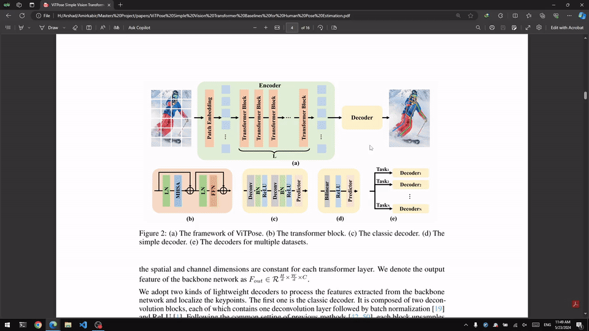

## GHD Screenshot
a tool for automating the process of taking a region screenshot, giving it a name and saving it to a file.

I plan to use it to efficiently take screenshots of papers I read, and later upload them to overleaf for my M.Sc. thesis.

problem with windows snipping tool? 



## Features
- take a region screenshot
- give the screenshot a name
- save the screenshot to a file
- automatically open the file in the default image viewer
- copy the file path to the clipboard

## Requirements
- python3
- pillow
- pygame
```bash
pip install pillow pygame
```

Currently, the tool is only tested on **Windows 10**.

## Usage
```bash
python ghd_screenshot.py
```

I have assigned a hotkey to the tool using *autohotkey*, so I can take a screenshot by pressing `Win + Shift + Q`.

**note for myself:** place the script named `ghd-screenshot.pyw` in `C:\`.

**autohotkey line:** 
`#+Q::Run, pythonw C:\ghd-screenshot.py`

## Credits
Gholamreza Dar x ChatGPT! 2024
